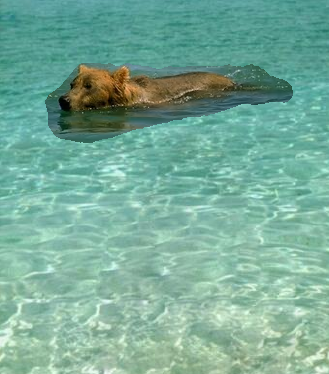
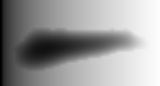

## [compho] LAB 8 


Whole logic in poisson.py  

```bash
python3 main.py # executes tests for first and second task (+ rampTest)
```


#### naive


#### rampTest




#### poisson 

50 => 500 => 2000 => 3200   


